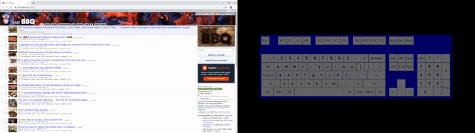

# res_settings
These settings are for https://old.reddit.com/ with Reddit Enhancement Suite. They contain some general tweaks and useful keybings. With the keybinds, Reddit can be navigated easily without a mouse.

## Setup Instructions
1. Click the gear in the top right and select "RES settings console".
2. Navigate to "About RES" -> "Restore". Alternatively go to: https://old.reddit.com/#res:settings/backupAndRestore.
3. Select "File" and upload [settings.resbackup](settings.resbackup) from this repo.

## Important keybinds
* Q: Go to next post/comment on same level
* W: Go to previous post/comment on same level
* E: Go down one comment level. Also useful for going from initial post to 1st comment (see example).
* R: Toggle image view
* D: Open comments in new windows
* F: Open link and comments in new windows
* A: Upvote
* Z: Downvote
* S: Next image in album
* G: Previous image in album
* X: Go to parent comment's sibling

Note: I put ring finger on "Q"

## Example Navigation

